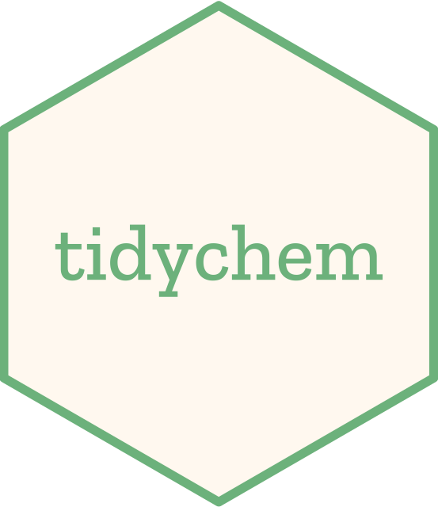

# tidychem 

<!-- badges: start -->
[](https://www.tidyverse.org/lifecycle/#experimental)
[](https://github.com/nanxstats/tidychem/actions/workflows/R-CMD-check.yaml)
<!-- badges: end -->

Read, preprocess, and featurize chemical data using RDKit.

The `tidychem` package offers a lightweight R interface for accessing RDKit via the [RDKit Python API](https://www.rdkit.org/docs/api-docs.html).


## Installation

First of all, [install RDKit](https://www.rdkit.org/docs/Install.html). Make sure it is [discoverable by reticulate](https://rstudio.github.io/reticulate/articles/versions.html).

Then install `tidychem` with:

```r
remotes::install_github("nanxstats/tidychem")
```

## Usage

```r
reticulate::use_python("/usr/local/bin/python3")

library("tidychem")

"smi-multiple.smi" |>
  tidychem_example() |>
  read_smiles() |>
  fp_morgan()
```

## Developers

If you have already installed Python and tidychem, and want to develop tidychem in RStudio, simply create a file `.Rprofile` under the package directory and set the Python binary path (Homebrew Python 3 path example below):

```r
Sys.setenv(RETICULATE_PYTHON = "/usr/local/bin/python3")
```

The next time you open the project, the correct Python path and library path should be already set. For more technical details, see [reticulate Python version configuration](https://rstudio.github.io/reticulate/articles/versions.html).

## License

tidychem is free and open source software, licensed under GPL-3.
